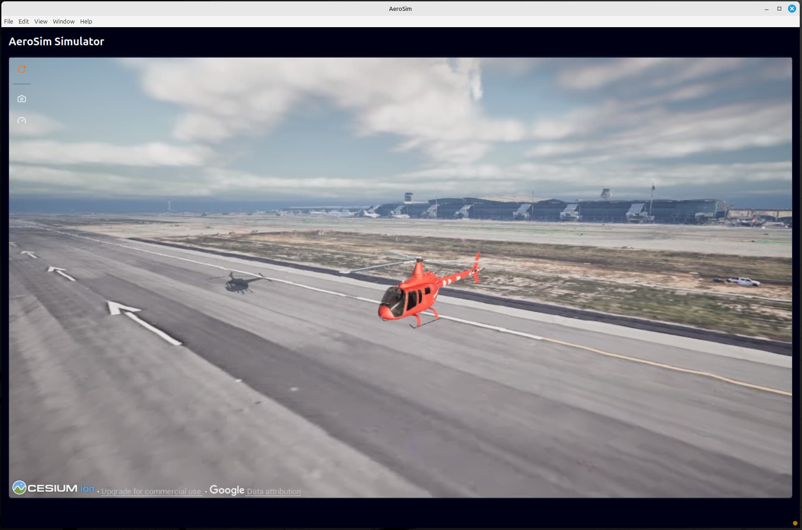
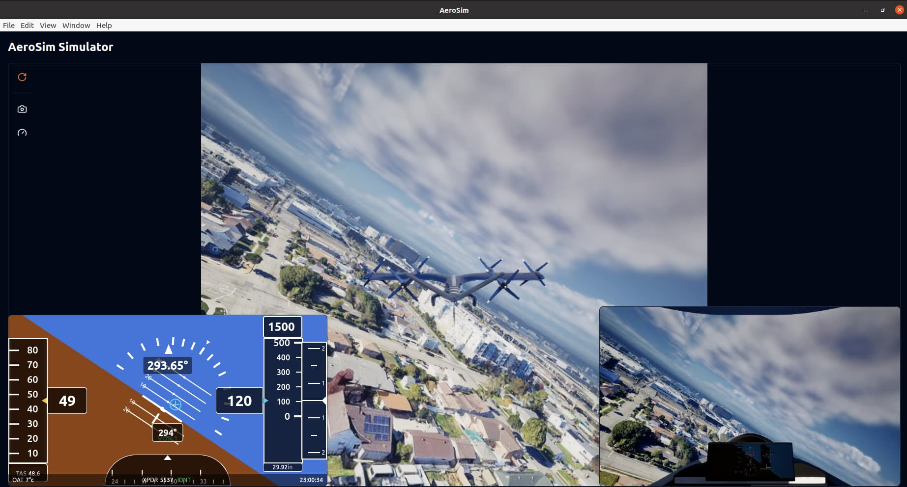
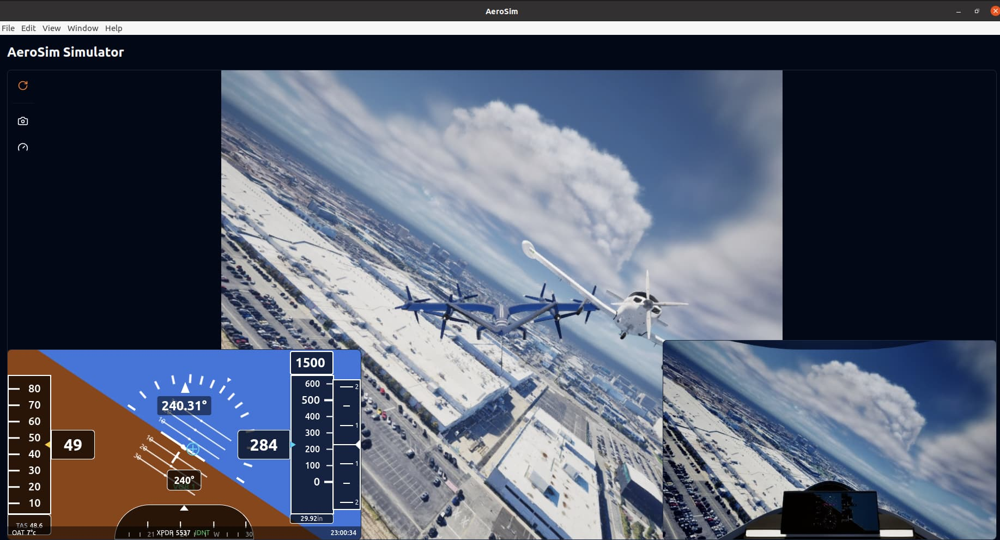
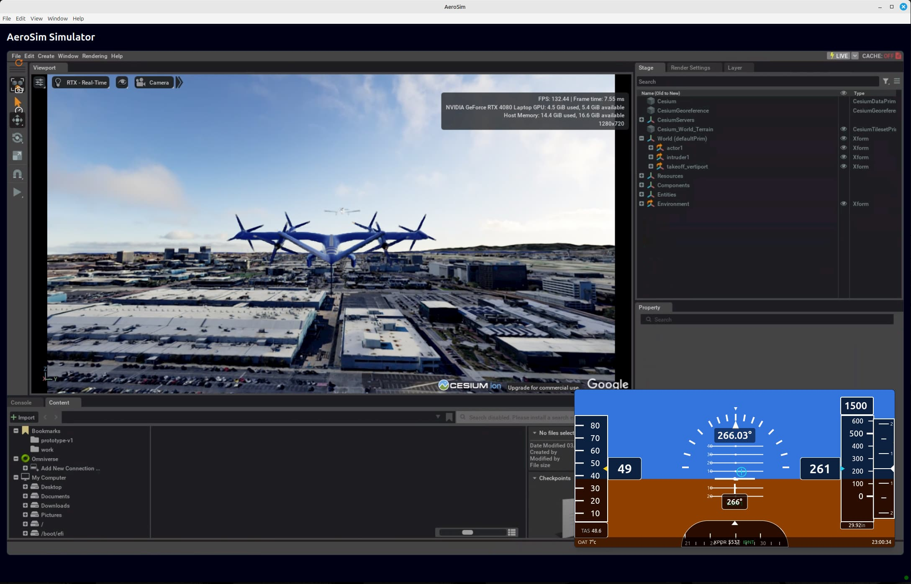

# AeroSim

AeroSim is a comprehensive flight simulation framework that combines Rust and Python components to provide a powerful and flexible simulation environment.

## Showcase

|                |             |                                      |
| :-------------------------------------------------------------------------------------------------: | :--------------------------------------------------------------------------------------------------: | :------------------------------------------------------------------------------------------------------------------------: |
| **First Flight (Linux)** <br> `./launch_aerosim.sh --unreal` <br> `python examples/first_flight.py` | **First Flight (Windows)** <br> `launch_aerosim.bat --unreal` <br> `python examples/first_flight.py` | **Tutorial First Steps (Linux)** <br> `./launch_aerosim.sh --unreal-editor` <br> `python examples/tutorial_first_steps.py` |

|                                                    |                                                 |                                            |
| :------------------------------------------------------------------------------------------------------------------------------: | :---------------------------------------------------------------------------------------------------------------------------------: | :--------------------------------------------------------------------------------------------------------------------------------------: |
| **Autopilot DAA Takeoff** <br> `./launch_aerosim.sh --unreal --pixel-streaming` <br> `python examples/autopilot_daa_scenario.py` | **Autopilot DAA Mid-flight** <br> `./launch_aerosim.sh --unreal --pixel-streaming` <br> `python examples/autopilot_daa_scenario.py` | **Autopilot DAA Close Encounter** <br> `./launch_aerosim.sh --unreal --pixel-streaming` <br> `python examples/autopilot_daa_scenario.py` |

|                                    |                                                           |                                             |
| :------------------------------------------------------------------------------------------------------------------------------: | :----------------------------------------------------------------------------------------------------------------------------------------------: | :-----------------------------------------------------------------------------------------------------------------------------: |
| **Autopilot DAA with Omniverse (Linux)** <br> `./launch_aerosim.sh --omniverse` <br> `python examples/autopilot_daa_scenario.py` | **Pilot Control with Omniverse (Windows)** <br> `launch_aerosim.bat --omniverse-editor` <br> `python examples/pilot_control_with_flight_deck.py` | **Simulink Co-simulation (Windows)** <br> `launch_aerosim.bat --unreal-editor` <br> `python examples/simulink_cosim_and_fmu.py` |

## Project Structure

The AeroSim project consists of several components:

- **aerosim**: The main Python package
- **aerosim-app**: A React/TypeScript UI for visualization and control
- **aerosim-unreal-project**: Unreal Engine renderer for visualization
- **aerosim-omniverse-kit-app**: Omniverse renderer for visualization

## Features

- **Flight Simulation**: Simulate various aircraft with realistic physics
- **FMU Integration**: Use Functional Mock-up Units for component modeling
- **Multiple Renderers**: Support for Unreal Engine and Omniverse renderers
- **WebSockets Communication**: Real-time communication between components
- **Input Handling**: Support for keyboard, gamepad, and remote inputs
- **Visualization**: Camera streaming and flight display data
- **Cross-Platform**: Works on both Windows and Linux

## Installation

### Prerequisites

- Python 3.12 or higher
- Rust toolchain (for building Rust components)
- [Rye](https://rye-up.com/) or [uv](https://github.com/astral-sh/uv) for Python package management
- [Bun](https://bun.sh/) for aerosim-app (not npm)

### Installation Steps

For detailed installation instructions, please refer to the build documentation for [Linux](docs/build_linux.md) and [Windows](docs/build_windows.md). Below is a quick start guide.

1. Clone the repository:

   ```bash
   git clone https://github.com/aerosim-open/aerosim.git
   cd aerosim
   ```

1. Run the pre-install and install scripts for your platform:

   ```bash
   # Windows
   pre_install.bat
   install_aerosim.bat

   # Linux
   ./pre_install.sh
   ./install_aerosim.sh
   ```

1. Build AeroSim

  ```
  # Windows
  build_aerosim.bat

  # Linux
  ./build_aerosim.sh
  ```

  Alternatively, you can run the following commands for more control over the steps and build options:

  ```
  # Windows
  rye sync
  .venv\Scripts\activate
  rye run build

  # Linux
  rye sync
  source .venv/bin/activate
  rye run build
  ```

## Usage

### Running a Simulation

1. Launch AeroSim with Unreal renderer and pixel streaming:

   ```bash
   # Windows
   launch_aerosim.bat --unreal --pixel-streaming

   # Linux
   ./launch_aerosim.sh --unreal --pixel-streaming
   ```

1. Start the aerosim-app for visualization:

   ```bash
   cd ../aerosim-app
   bun run dev
   ```

1. Run one of the example scripts:

   ```bash
   # First flight example program
   python examples/first_flight.py

   # Pilot control with flight deck
   python examples/pilot_control_with_flight_deck.py
   ```

### Using the Python API

```python
import asyncio
from aerosim import AeroSim, start_websocket_servers

# Create and run a simulation
sim = AeroSim(enable_websockets=True)
sim.run("config/sim_config.json")

# Start WebSockets servers for aerosim-app communication
asyncio.run(start_websocket_servers())
```

## Package Structure

The `aerosim` package has a modular structure:

- `aerosim.core`: Core simulation classes
- `aerosim.io`: Input/output handling
  - `aerosim.io.websockets`: WebSockets integration
  - `aerosim.io.input`: Input handling
- `aerosim.visualization`: Visualization utilities
- `aerosim.utils`: Common utility functions

## Examples

The package includes several example scripts:

- `first_flight.py`: First flight to get started
- `pilot_control_with_flight_deck.py`: Pilot control with flight deck
- `autopilot_daa_scenario.py`: Autopilot with detect and avoid scenario
- `simulink_cosim_and_fmu.py`: Simulink co-simulation with FMU models

## Building from Source

To build the package from source:

```bash
python build.py
```

This will build all Rust crates and create Python wheels for installation.

## Dependencies

The package depends on:

- Rust components:

  - `aerosim-controllers`: Flight control systems
  - `aerosim-core`: Core utilities
  - `aerosim-data`: Data types and middleware
  - `aerosim-dynamics-models`: Aircraft dynamics models
  - `aerosim-scenarios`: Simulation scenarios
  - `aerosim-sensors`: Sensor models
  - `aerosim-world`: Simulation world and orchestration
  - `aerosim-world-link`: Interface between Rust and Python

- Python dependencies:
  - `websockets`: WebSockets communication
  - `opencv-python`: Image processing
  - `numpy`: Numerical operations

## License

This project is dual-licensed under both the MIT License and the Apache License, Version 2.0.
You may use this software under the terms of either license, at your option.

See the [LICENSE](LICENSE) file for details.
