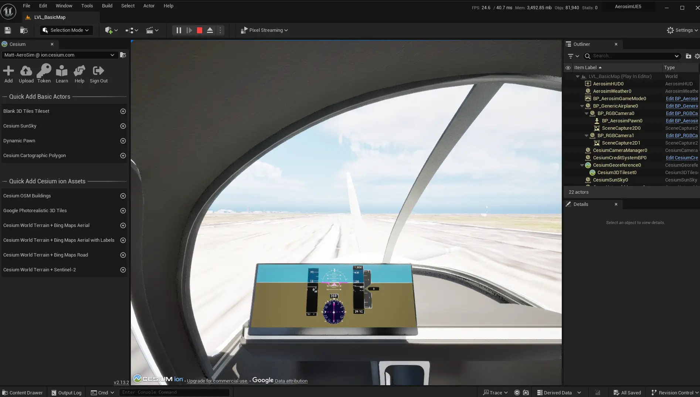

# AeroSim Linux installation

This guide demonstrates how to setup and build AeroSim in __Ubuntu 22.04__.
(AeroSim on Linux requires Ubuntu version 22.04 or higher)

* [__Set up accounts__](#set-up-accounts)
* [__Using Unreal as a renderer__](#using-unreal-as-a-renderer)
* [__Set up Cesium token__](#set-up-cesium-token)
* [__Install and build AeroSim__](#install-and-build-aerosim)
* [__Verify installation__](#verify-installation)

---

## Set up accounts

Before you start, you should set up the necessary accounts needed to gain access to assets needed by AeroSim:

* [__GitHub__](https://github.com/signup): AeroSim is hosted on GitHub
* [__Epic Games__](https://www.epicgames.com/id/register/date-of-birth): To use Unreal as a renderer for AeroSim, an Epic account is required download an Unreal Engine 5.3 installed-build or build from source
* [__NVIDIA__](https://developer.nvidia.com/omniverse#section-getting-started): To use Omniverse Kit as a renderer for AeroSim, an AeroSim Omniverse Kit 105.1 App example is provided through the AeroSim installation process but in order to access the full Omniverse ecosystem or do Kit app development, an NVIDIA developer account is required
* [__Cesium__](https://ion.cesium.com/signup/): AeroSim uses 3D map tile assets from Cesium

---

## Using Unreal as a renderer

To use Unreal as a renderer, download Unreal Engine 5.3 or clone and build it from source.

### Download Unreal Engine 5.3

Download Unreal Engine 5.3 for Linux from [this link](https://www.unrealengine.com/en-US/linux) and install it following the instructions.
Alternatively, you can follow the instructions in the next section to build from source.

### Clone and build Unreal Engine 5.3 from source

In order to authorise the download of the Unreal Engine 5.3 repository, you must link your GitHub account with Epic Games. Follow [this guide](https://www.unrealengine.com/en-US/ue-on-github) to link your accounts. You will need to provide your GitHub credentials (username and [token](https://docs.github.com/en/authentication/keeping-your-account-and-data-secure/managing-your-personal-access-tokens)) to authorise the download. You may also wish to [authorize to GitHub through SSH](https://docs.github.com/en/authentication/connecting-to-github-with-ssh).

```sh
git clone -b 5.3 --depth=1 git@github.com:EpicGames/UnrealEngine.git
```

Now build Unreal Engine 5.3, this process could take up to 3 hours.

```sh
./Setup.sh && ./GenerateProjectFiles.sh && make
```

Create an environment variable to locate the root folder of the Unreal Engine 5.3 repository, you may want to add this to your `.bashrc` profile.

```sh
export AEROSIM_UNREAL_ENGINE_ROOT=/path/to/UnrealEngine
```

---

## Set up Cesium token

To access Cesium 3D tile assets, you will need to set up an access token. Log in to your Cesium account and go to the *Access Tokens* tab. If you don't already have a token, click on *Create Token* and create a new token with the default settings. Copy the token into an environment variable named `AEROSIM_CESIUM_TOKEN` in the shell where you will execute the launch script:

```sh
export AEROSIM_CESIUM_TOKEN=<cesium_token>
```

You may want to add this to your `.bashrc` profile to persist.

---

## Install and build AeroSim

First, clone the main AeroSim repository:

```sh
git clone https://github.com/aerosim-open/aerosim.git
```

Once the repository is cloned, enter the root directory of the repository and run the `pre_install.sh` script to check and install the pre-requisites:

```sh
cd aerosim
bash ./pre_install.sh
```

After this is complete, run the `install_aerosim.sh` script to install AeroSim:

```sh
bash ./install_aerosim.sh
```

The install script will notify you of several environment variables that are set up for AeroSim to run. Add these environment variables in your `.bashrc` file to persist them in new terminal instances. Please check the [expected output](install_aerosim_exp_out_linux.md) if you encounter problems.

To build AeroSim, run:

```sh
bash ./build_aerosim.sh
```

Alternatively, you can run the following commands for more control over the steps and build options:

```sh
rye sync
source .venv/bin/activate
rye run build
```

## Verify installation

Once AeroSim has been built successfully and the related environment variables are set, launch AeroSim with the launch script. Open a terminal in the repository root directory:

```sh
# For using Unreal rendering in native Editor mode
./launch_aerosim.sh --unreal-editor

# For using Omniverse rendering in native Kit app mode
./launch_aerosim.sh --omniverse
```

This should launch the AeroSim project in the Unreal Editor or Omniverse Kit app. Add a *Google Photorealistic 3D Tile* asset from the Cesium ion Assets menu (sign into Cesium ion if necessary) then press the green play control at the top of the Unreal Engine or Omniverse interface. This will start the renderer ready for a simulation.

Next, open a new terminal in the repository root directory and activate the AeroSim virtual environment, which has all the Python dependencies installed:

```sh
source .venv/bin/activate
```

Then run the `first_flight.py` Python script from within the examples folder:

```sh
cd examples
python first_flight.py
```

In the Unreal Editor or Omniverse Kit app viewport you should see an interior view of an aircraft taking off from a runway:



 If this example runs successfully, your installation has been successful!
